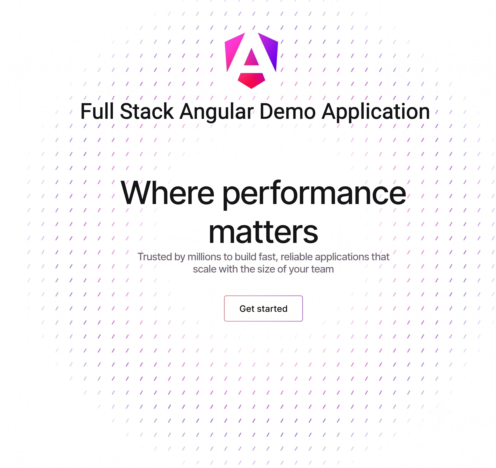

# Angular Task Manager on Google Cloud

[](https://opensource.org/licenses/MIT)
[](https://cloud.google.com/)
[](https://angular.dev/)

A full-stack Angular application with Server-Side Rendering (SSR), integrated with an Express Node.js backend, and deployed to Google Cloud Run. The application persists data using a PostgreSQL database hosted on Google Cloud SQL, authenticating securely via IAM service accounts.

---

## Go Angular




---

## Table of Contents

1. [Architecture](#architecture)
2. [Prerequisites](#prerequisites)
3. [Project Setup](#project-setup)
4. [Deployment](#deployment)
5. [API Endpoints](#api-endpoints)
6. [License](#license)

---

## Architecture

This project utilizes a modern, serverless Google Cloud stack:

* **Frontend**: Angular 19 (Standalone Components, SSR)
* **Backend**: Node.js with Express (integrated via `@angular/ssr/node`)
* **Database**: PostgreSQL 14 hosted on Google Cloud SQL
* **Authentication**: Google Cloud IAM Authentication (No raw database passwords stored in code)
* **Hosting**: Google Cloud Run (Fully managed serverless container execution)

---

## Prerequisites

To manage and deploy this application, ensure you have the following installed and configured:

* [Google Cloud SDK (`gcloud` CLI)](https://cloud.google.com/sdk/docs/install)
* [Node.js](https://nodejs.org/) (v18 or higher)
* [Angular CLI](https://angular.dev/)
* [GitHub CLI (`gh`)](https://cli.github.com/)

---

Enable the necessary APIs for the application to function:

```bash
gcloud services enable \
  sqladmin.googleapis.com \
  run.googleapis.com \
  artifactregistry.googleapis.com \
  cloudbuild.googleapis.com

```

### 2. Service Account Setup

The application uses a dedicated service account to securely interact with Cloud SQL:

* Create the service account (`quickstart-service-account`).
* Grant it the following roles:
* `roles/cloudsql.client`
* `roles/cloudsql.instanceUser`
* `roles/logging.logWriter`


### 3. Database Initialization

Provision a PostgreSQL instance and database, then grant access to your service account:

```bash
# Create Instance
gcloud sql instances create quickstart-instance --database-version=POSTGRES_14 --cpu=4 --memory=16GB --region=us-central1 --database-flags=cloudsql.iam_authentication=on

# Create Database
gcloud sql databases create quickstart_db --instance=quickstart-instance

# Authorize Service Account
gcloud sql users create quickstart-service-account@[YOUR_PROJECT_ID].iam --instance=quickstart-instance --type=cloud_iam_service_account

```

---

## Deployment

To deploy the application to Google Cloud Run, navigate to the `angular-app` directory and execute the following command. The source code will be automatically containerized and deployed.

```bash
gcloud run deploy to-do-tracker \
    --region=us-central1 \
    --source=. \
    --service-account="quickstart-service-account@[YOUR_PROJECT_ID].iam.gserviceaccount.com" \
    --allow-unauthenticated

```

Upon successful deployment, the terminal will output a secure HTTPS URL where the application is live.

---

## API Endpoints

The Express server exposes the following RESTful endpoints to manage tasks:

| Method | Endpoint | Description | Payload |
| --- | --- | --- | --- |
| **GET** | `/api/tasks` | Retrieves the latest 100 tasks. | None |
| **POST** | `/api/tasks` | Creates a new task. | `{ "title": "string" }` |
| **PUT** | `/api/tasks` | Updates task title or status. | `{ "id": "string", "title": "string", "status": "string" }` |
| **DELETE** | `/api/tasks` | Deletes a task by ID. | `{ "id": "string" }` |

*Note: The `tasks` table is automatically created in the database upon the first API request if it does not already exist.*

---

## License

This project is licensed under the MIT License.
